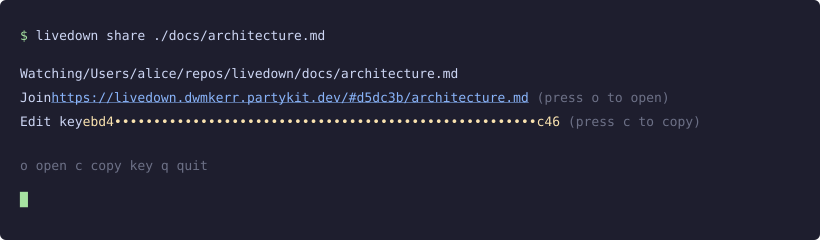
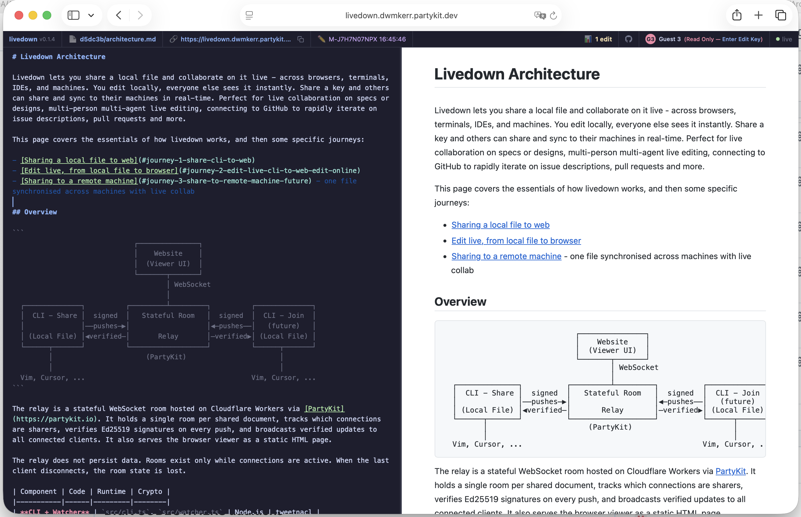

<p align="center">
  <h2 align="center"><code>📝 livedown</code></h2>
  <h3 align="center">Share a local markdown file and collaborate live in a browser and across machines.</h3>
  <p align="center">
    <a href="https://livedown.dwmkerr.partykit.dev">Site</a> |
    <a href="#quickstart">Quickstart</a> |
    <a href="#commands">Commands</a> |
    <a href="#developer-guide">Developer Guide</a> |
    <a href="#security">Security</a> |
    <a href="#advanced">Advanced</a> |
    <a href="#how-it-works">How It Works</a>
  </p>

  <p align="center">
    <a href="https://github.com/dwmkerr/livedown/actions/workflows/cicd.yaml"></a>
    <a href="https://github.com/dwmkerr/livedown/actions/workflows/deploy.yaml"></a>
    <a href="https://www.npmjs.com/package/@dwmkerr/livedown"></a>
    <a href="https://codecov.io/gh/dwmkerr/livedown"></a>
  </p>
</p>

## Quickstart

Run `livedown share`:

```bash
npx @dwmkerr/livedown share ./docs/architecture.md
```

The CLI syncs the file to an ephemeral relay and provides a URL for others to view. An edit key can be shared to allow others to edit the file - changes will be synched to the local filesystem by the CLI.

<p align="center">
  
</p>

The ephemeral relay will look similar to the below, and disappear when the CLI is terminated:

<p align="center">
  
</p>

## Commands

### `livedown share <file>`

Watch a local file and share it live.

```bash
livedown share ./notes.md
```

Options:
- `-r, --relay <host>` — Relay host (default: `livedown.dwmkerr.partykit.dev`)
- `-e, --editor <name>` — Your name shown to viewers
- `-k, --edit-key <key>` — Edit key (auto-generated if omitted)
- `-p, --private` — Require a view key to read the document (auto-generates one)
- `--view-key <key>` — View key for private mode (auto-generated if omitted; implies `--private`)

By default anyone with the Join URL can read the document. With `--private`, the CLI prints a separate **view key** that viewers must enter before any content is delivered — a leaked URL reveals nothing. The edit key also grants view access, so editors need only one secret.

## Developer Guide

Run the full stack locally — relay, viewer, and CLI all on your machine, no deployed relay required. PartyKit serves the relay *and* `public/` on `http://localhost:1999` with caching disabled, so edits to `public/index.html` show up on browser refresh.

```bash
# Clone, install, build, link.
git clone git@github.com:dwmkerr/livedown.git
cd livedown
npm install && npm run build && npm link

# Terminal 1 — relay + viewer on localhost:1999.
npm run relay:dev

# Terminal 2 — rebuild dist/ on save so `livedown` always runs latest source.
npm run build:watch

# Terminal 3 — share a file against the local relay.
PARTYKIT_HOST=localhost:1999 livedown --dev share ./README.md
```

The CLI prints a `http://localhost:1999/#…` URL. Open it and iterate.

See [CONTRIBUTING.md](CONTRIBUTING.md) for pull request requirements.

## Security

Livedown writes remote content to your local disk, so every update is signed with **Ed25519** and verified by three independent layers before anything lands on your filesystem:

- The **relay** rejects pushes without a valid signature.
- The **watcher** on your machine re-verifies every incoming update before writing to disk.
- The **browser** checks that any entered edit key matches the room's public key before it will send a push.

The URL is a locator, not a credential — it is safe to share. The edit key is the credential and must stay private.

**Private mode** (`--private`) adds a **view key** that gates reading as well, so a leaked URL exposes no content. The view key is independent of the edit key, but the edit key also grants view access. View gating is enforced at the relay (the relay already holds content in plaintext); for confidentiality *from* the relay you would need end-to-end encryption, which livedown does not currently do.

See [docs/architecture.md](docs/architecture.md) for the full security model, including the keypair lifecycle and defense-in-depth table.

## Advanced

### Docker

Running Livedown in Docker isolates it from your local filesystem — only the directory you bind-mount is visible to the CLI. Useful as an extra security boundary when running untrusted documents.

```bash
docker run --rm -v "$(pwd):/data" ghcr.io/dwmkerr/livedown share /data/notes.md
```

Pass additional CLI flags after the image name:

```bash
docker run --rm -v "$(pwd):/data" ghcr.io/dwmkerr/livedown share /data/notes.md \
  --editor "Alice" \
  --edit-key <your-edit-key>
```

> **Platform note:** The published image targets `linux/amd64`. ARM users (Apple Silicon, Raspberry Pi) should build locally: `docker build -t livedown-local .`

## How It Works

```
 Your Machine             Relay                    Collaborator
 ┌──────────┐            ┌──────────────┐          ┌──────────┐
 │ notes.md │───signed──▶│  Verify sig  │──update─▶│ Browser  │
 │          │◀──verify───│  Broadcast   │◀─signed──│          │
 └──────────┘            └──────────────┘          └──────────┘
```

Livedown is three pieces:

1. A **CLI** on your machine watches your markdown file and pushes signed updates when it changes.
2. A **relay** in the cloud forwards those updates to everyone connected to the same document.
3. A **browser viewer** renders the document live, and — with the edit key — lets collaborators edit it back.

Details on the state machine, message protocol, security model, and the PartyKit / Cloudflare Workers relay setup live in [docs/architecture.md](docs/architecture.md).

## OpenSpec Flow

This repo uses **OpenSpec Flow** — a GitHub Actions workflow that drives a Claude Code agent through the full OpenSpec lifecycle: issues become spec PRs, spec PRs become implementation PRs, and either can be refined on demand by adding the `openspec:start` label. See [`CLAUDE.md`](CLAUDE.md) for agent permission setup, secret rotation, and project conventions.

### Troubleshooting

- **Agent runs don't produce output, or produce very limited results.** Known issue with upstream [`anthropics/claude-code-action`](https://github.com/anthropics/claude-code-action/issues/874): if the Anthropic account's credit is too low or unavailable, the SDK ends the run after a short number of turns with an error that is not propagated up to the workflow. The step reports success, but no branch or PR is created — impl PRs contain only archived spec content, issue state flips to `openspec:review` with nothing to review. Mitigation: top up credit on [console.anthropic.com](https://console.anthropic.com/), or set `CLAUDE_CODE_OAUTH_TOKEN` to run against a Claude subscription instead of API billing. Tracked in [#98](https://github.com/dwmkerr/livedown/issues/98).

- **Both `ANTHROPIC_API_KEY` and `CLAUDE_CODE_OAUTH_TOKEN` set at once.** The Claude Agent SDK prefers the API key (same precedence as the local `claude` CLI), so OAuth is ignored. Delete whichever secret you don't want to use. See [`CLAUDE.md` → Secrets](CLAUDE.md) for rotation notes and Anthropic's [authentication docs](https://code.claude.com/docs/en/authentication) / [consumer terms](https://www.anthropic.com/legal/consumer-terms) before using OAuth in CI — sanctioned for personal use on your own repo, but firing on third-party events ([#838](https://github.com/anthropics/claude-code-action/issues/838)) has led to account bans.

## License

MIT

---

<sub>UI prototyped on [Claude Design](https://claude.ai/design/p/68395513-244f-402c-b6ee-77499c42f583?file=Livedown+Designs.html). See [`design/`](design/) for artifacts, [`docs/design.md`](docs/design.md) for the implementation contract.</sub>
