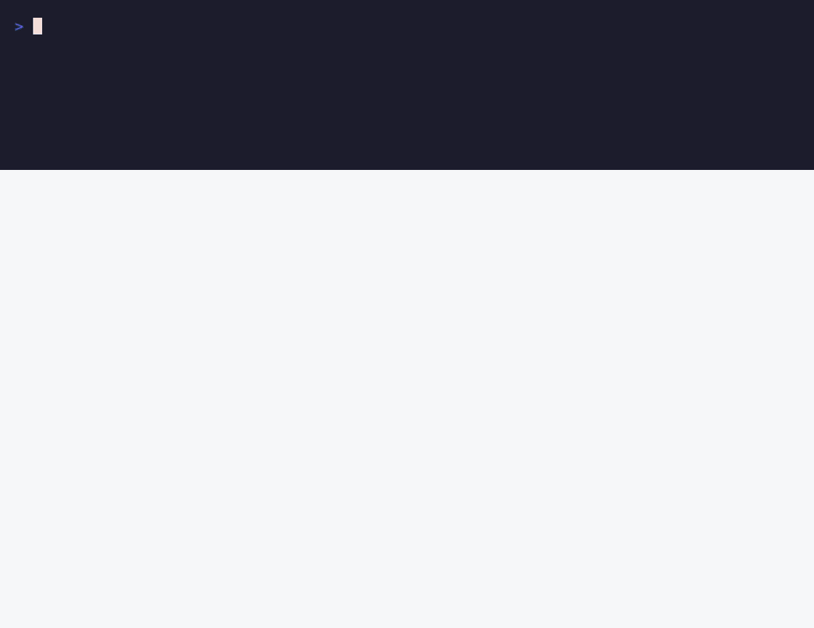
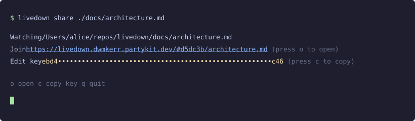
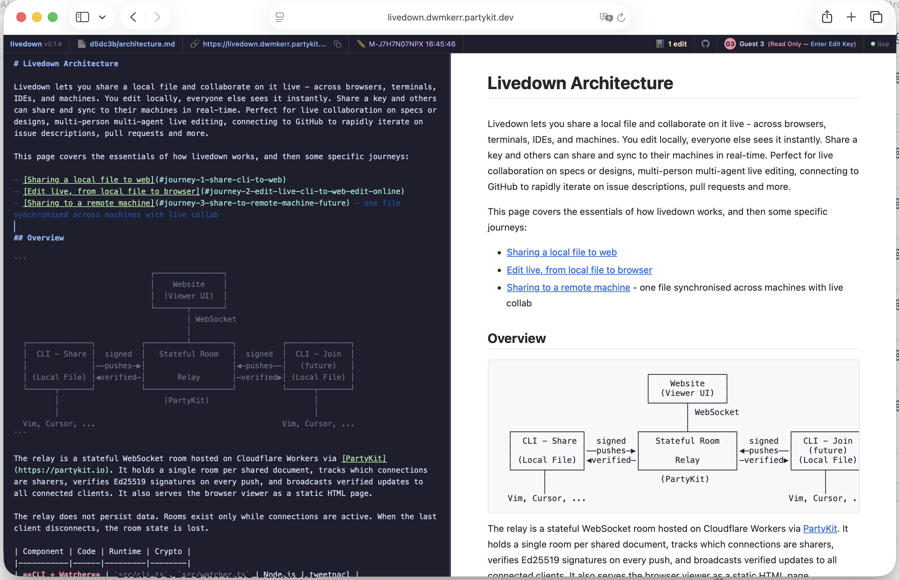

<!-- openspec-flow badge-start -->
[](https://github.com/dwmkerr/livedown/actions/workflows/openspec-flow.yml)
<!-- openspec-flow badge-end -->

<p align="center">
  <h2 align="center"><code>📝 livedown</code></h2>
  <h3 align="center">View and edit a local Markdown file in your browser, or share it for live collaboration</h3>
  <p align="center">
    <a href="https://livedown.dwmkerr.partykit.dev">Site</a> |
    <a href="#quickstart">Quickstart</a> |
    <a href="#commands">Commands</a> |
    <a href="#developer-guide">Developer guide</a> |
    <a href="#security">Security</a> |
    <a href="#advanced">Advanced</a> |
    <a href="#how-it-works">How it works</a>
  </p>

  <p align="center">
    <a href="https://github.com/dwmkerr/livedown/actions/workflows/cicd.yaml"></a>
    <a href="https://github.com/dwmkerr/livedown/actions/workflows/deploy.yaml"></a>
    <a href="https://github.com/dwmkerr/livedown/actions/workflows/openspec-flow.yaml"></a>
    <a href="https://www.npmjs.com/package/@dwmkerr/livedown"></a>
    <a href="https://codecov.io/gh/dwmkerr/livedown"></a>
  </p>
</p>

<p align="center">
  
</p>

## Quickstart

Preview and edit a file locally:

```bash
npx @dwmkerr/livedown view ./docs/architecture.md
```

Browser edits update the file, and file edits update the browser. Your document never leaves your machine.

To share the file:

```bash
npx @dwmkerr/livedown share ./docs/architecture.md
```

The CLI syncs the file to an ephemeral relay and prints a URL. Share the edit key to let others edit; the CLI writes their changes to the local file.

<p align="center">
  
</p>

The relay is ephemeral - it disappears when the CLI is terminated:

<p align="center">
  
</p>

## Commands

### `livedown view <file>`

Preview and edit a local file in the browser. Your document never leaves your machine.

```bash
livedown view ./notes.md
```

The CLI serves the viewer on `127.0.0.1` and opens it. Browser edits update the file, and file edits update the browser.

Options:

- `-e, --editor <name>`: Name shown in the editor
- `-P, --port <port>`: Local port (`0`, the default, picks a free one)
- `--no-open`: Do not open the browser automatically

The document is served only to `127.0.0.1`, under a URL carrying a single-use access token, and the page rejects WebSocket connections from any other origin. The page itself still fetches fonts from Google, and mermaid from a CDN for documents containing diagrams.

### `livedown share <file>`

Watch a local file and share it live.

```bash
livedown share ./notes.md
```

Options:

- `-r, --relay <host>`: Relay host (default: `livedown.dwmkerr.partykit.dev`)
- `-e, --editor <name>`: Your name shown to viewers
- `-k, --edit-key <key>`: Edit key (auto-generated if omitted)
- `-p, --private`: Require a view key to read the document (auto-generates one)
- `--view-key <key>`: View key for private mode (auto-generated if omitted; implies `--private`)

By default, anyone with the Join URL can read the document. With `--private`, the CLI prints a separate **view key** that viewers must enter before any content is delivered. A leaked URL reveals nothing. The edit key also grants view access, so editors need only one secret.

## Developer guide

Run the full stack locally, with the relay, viewer, and CLI all on your machine. PartyKit serves the relay *and* `public/` on `http://localhost:1999` with caching disabled, so edits to `public/index.html` show up on browser refresh.

```bash
# Clone, install, build, link.
git clone git@github.com:dwmkerr/livedown.git
cd livedown
npm install && npm run build && npm link

# Terminal 1: relay + viewer on localhost:1999.
npm run relay:dev

# Terminal 2: rebuild dist/ on save so `livedown` always runs latest source.
npm run build:watch

# Terminal 3: share a file against the local relay.
PARTYKIT_HOST=localhost:1999 livedown --dev share ./README.md
```

The CLI prints a `http://localhost:1999/#…` URL. Open it and iterate.

See [CONTRIBUTING.md](CONTRIBUTING.md) for pull request requirements.

## Security

Livedown writes remote content to your local disk, so every update is signed with **Ed25519** and verified independently at each layer before anything lands on your filesystem:

- The **relay** rejects pushes without a valid signature.
- The **watcher** on your machine re-verifies every incoming update before writing to disk.
- The **browser** checks that any entered edit key matches the room's public key before it will send a push.

The URL locates the document and is safe to share. The edit key is the credential and must stay private.

**Private mode** (`--private`) adds a **view key** that gates reading as well, so a leaked URL exposes no content. The view key is independent of the edit key, but the edit key also grants view access. View gating is enforced at the relay (the relay already holds content in plaintext); for confidentiality *from* the relay you would need end-to-end encryption, which livedown does not currently do.

See [docs/architecture.md](docs/architecture.md) for the full security model, including the keypair lifecycle and defense-in-depth table.

## Advanced

### Docker

Running Livedown in Docker isolates it from your local filesystem. Only the directory you bind-mount is visible to the CLI. This provides an extra security boundary when running untrusted documents.

```bash
docker run --rm -v "$(pwd):/data" ghcr.io/dwmkerr/livedown share /data/notes.md
```

Pass additional CLI flags after the image name:

```bash
docker run --rm -v "$(pwd):/data" ghcr.io/dwmkerr/livedown share /data/notes.md \
  --editor "Alice" \
  --edit-key <your-edit-key>
```

> **Platform note:** The published image targets `linux/amd64`. ARM users (Apple Silicon, Raspberry Pi) should build locally: `docker build -t livedown-local .`

## How it works

```
 Your Machine             Relay                    Collaborator
 ┌──────────┐            ┌──────────────┐          ┌──────────┐
 │ notes.md │───signed──▶│  Verify sig  │──update─▶│ Browser  │
 │          │◀──verify───│  Broadcast   │◀─signed──│          │
 └──────────┘            └──────────────┘          └──────────┘
```

`livedown view` replaces the relay with a local server on `127.0.0.1`. Both commands use the same browser viewer.

Livedown has these components:

- A **CLI** on your machine watches your markdown file and pushes signed updates when it changes.
- A **relay** in the cloud forwards those updates to everyone connected to the same document.
- A **browser viewer** renders the document live and lets collaborators with the edit key edit it back.

Details on the state machine, message protocol, security model, and the PartyKit / Cloudflare Workers relay setup live in [docs/architecture.md](docs/architecture.md).

## License

MIT

<!-- openspec-flow install-start -->
## openspec-flow

This repo uses [openspec-flow](https://github.com/dwmkerr/openspec-flow) to drive spec-driven development from GitHub issues.

1. Open an issue describing the feature, fix, or task.
2. Add the `openspec:go` label.
3. openspec-flow opens a **spec PR** (`openspec:spec`). Review, comment, iterate (add `openspec:go` to the PR to re-run). Merge when happy.
4. openspec-flow opens an **impl PR** (`openspec:impl`). Review, iterate, merge. The originating issue closes automatically.

Required Actions secret: `ANTHROPIC_API_KEY`.
<!-- openspec-flow install-end -->
