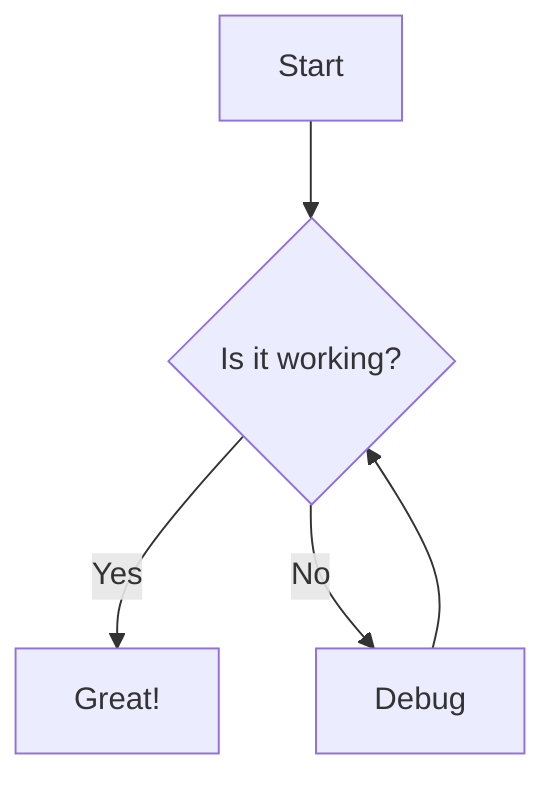
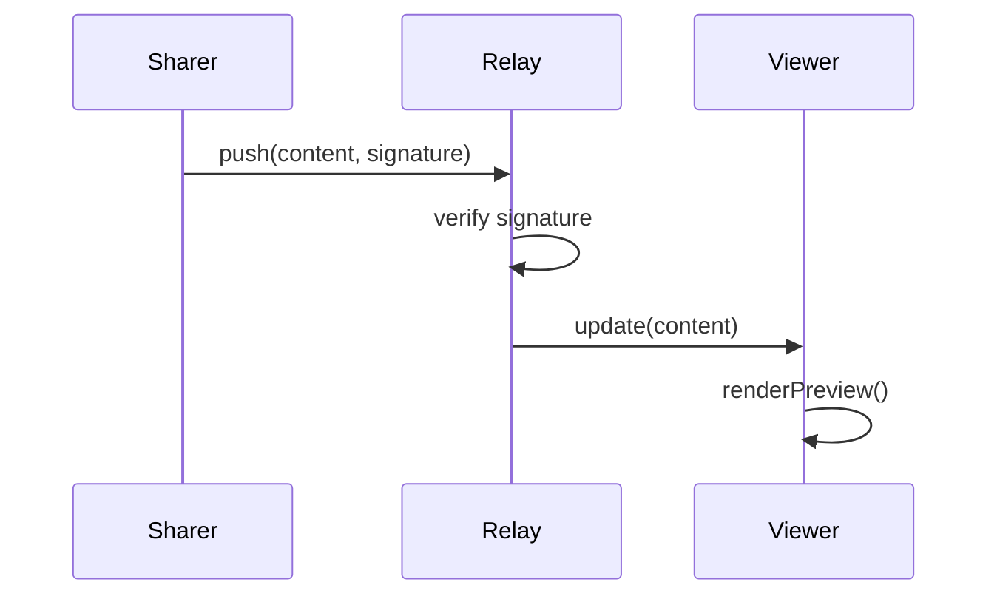

# Mermaid Diagram Test

This document tests Mermaid diagram rendering in the livedown viewer.

## Flowchart



## Sequence Diagram



## Regular Code Block (should not be rendered as a diagram)

```js
console.log("Hello, world!");
```
